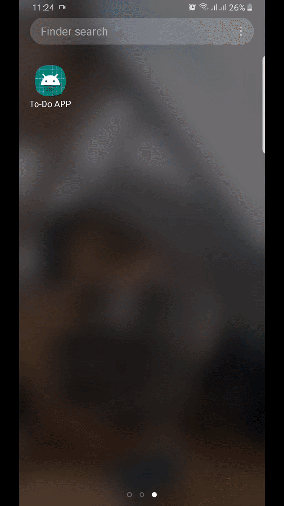

# Final Assignment - Developing Mobile Application
## TODO App
- This application is developed with a simple TODO list function. 
- It has functions to register and login within the app.
- This application has the features to add, delete and edit the task. The task can also be prioritized from high to low.
## Splash Screen

## Register Screen

## Login Screen

## Add Task Screen

## Delete Screen

## Logout Screen

